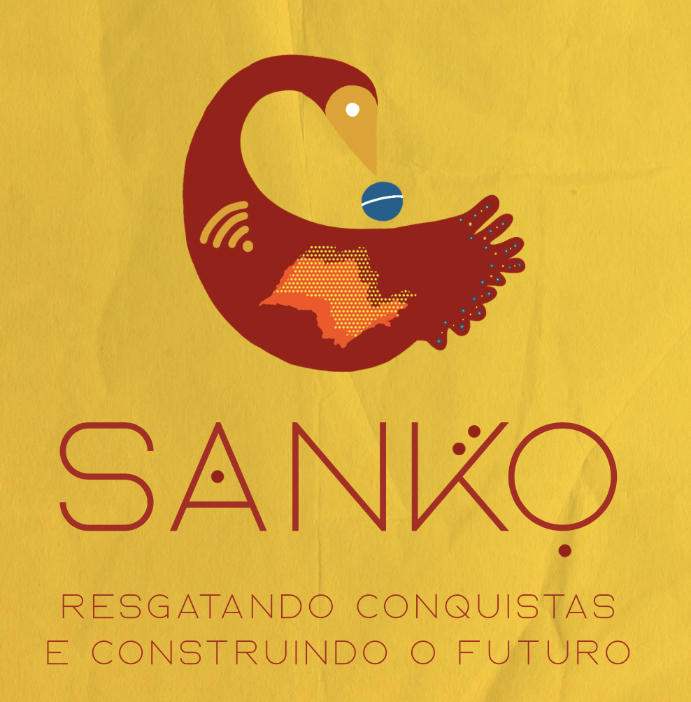

<p align="center">
  
</p>

# Sanko

🌐 **Acesse o jogo online:** [sanko.app.br](https://sanko.app.br)

**Sanko** é uma aplicação web interativa desenvolvida como uma **tecnologia social** para atuar como o Painel do Mestre em uma experiência híbrida de RPG e jogo de tabuleiro. 

O projeto foi criado como parte do [Crialab do Minha Campinas](https://www.minhacampinas.org/crialab), com financiamento da **Fundação FEAC**. A ferramenta nasceu com o objetivo inicial de resgatar e preservar a história de luta da comunidade pela construção da Escola Estadual Profa. Rita de Cássia da Silva, no Parque São Jorge (Campinas-SP). No entanto, o Sanko foi arquitetado de forma aberta e personalizável, para que possa **acolher e contar as histórias de lutas e conquistas de qualquer outra comunidade**.

A interface adota um estilo inspirado em jornais antigos, projetada para ser exibida em um telão ou projetor, guiando os jogadores através de fases históricas, gerenciando recursos (Força Comunitária), cronometrando debates e lançando minigames dinâmicos.

---

## Sobre o Projeto

O jogo funciona como uma ferramenta de facilitação, jogo educacional e engajamento comunitário. Ele conduz os participantes por uma linha do tempo onde desafios do passado são apresentados, exigindo debate, união e tomada de decisão para que a comunidade (os jogadores) avance e garanta melhorias para o bairro.

---

## Funcionalidades

* **Mapa das Memórias:** Integração com Leaflet.js permitindo "cravar" marcadores no mapa com relatos da comunidade. Os dados são salvos localmente.
* **Narrativa Dinâmica:** Sistema de fases (timeline) carregado externamente via JSON, permitindo trocar toda a história do jogo sem alterar o código.
* **Controle de Mesa:** Timer integrado para debates e painel de contagem de "Força Comunitária".
* **Sorteio de Minigames:** 5 minigames embutidos para desafiar os jogadores:
    * *O Povo Tem Memória?* (Quiz com múltiplas escolhas).
    * *Onde Está o Ofício?* (Batalha Naval/Radar visual).
    * *Quem Sou Eu?* (Dinâmica de adivinhação).
    * *Decifre o Código* (Descoberta de palavra-chave).
    * *Memória Viva* (Jogo da Memória digital integrado no telão ou modo para suporte a cartas físicas).
* **Design Responsivo:** O layout se adapta bem a monitores ultrawide (para projeção) e possui um menu otimizado para uso mobile.

---

## Tecnologias Utilizadas

* **Front-end:** HTML5, CSS3 (Variáveis, Flexbox, Grid) e JavaScript puro (Vanilla JS).
* **Mapas:** Leaflet.js
* **Armazenamento:** localStorage (para persistência de progresso e informações do mapa).
* **Infraestrutura:** Docker e Nginx (para deploy rápido via containers).

---

## Estrutura do Projeto

```text

/sanko
│
├── index.html               # Estrutura principal da aplicação
├── docker-compose.yml       # Orquestração do container Nginx
├── fases.json               # Dados das narrativas e fases históricas
├── quiz.json                # Perguntas, opções e respostas do quiz
├── minigames.json           # Banco de palavras e personagens dos minigames
│
├── css/
│   └── style.css            # Estilização conforme Identidade Visual
│
├── js/
│   └── script.js            # Lógica principal, timers e minigames
│
└── assets/                  # Pasta para imagens, fotos do carrossel e logo
    └── logo.png             # Logo da aplicação
